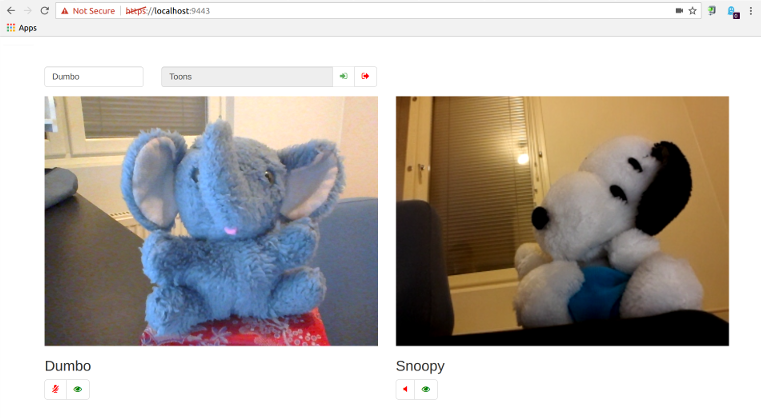

# WebRTC - ScalaJS - Play - Akka Stream videoconf demo

Simple demo combining the following technologies:
- WebRTC (tested with Chrome, should work with Firefox, definitely doesn't work with IE)
- ScalaJs 0.6.14
- Play Framework 2.5.10
- Akka Stream 2.4.12
- [Udash](http://udash.io/) 0.4.0

Start the server with options *-Dplay.crypto.secret=webrtc-demo-secret -Dhttps.port=9443*

and point your browser to [https://localhost:9443/](https://localhost:9443/)

